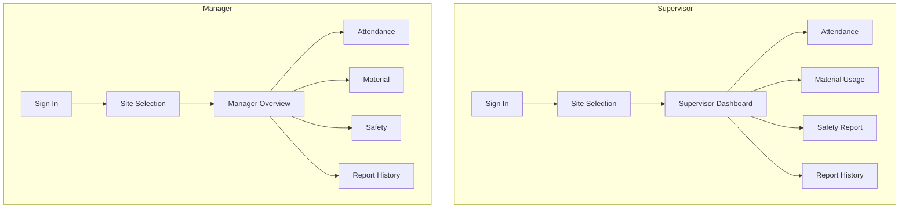

# Mock UX — Construction Site Reporting App

## 1. Purpose

This UX is being designed before implementation so the team can align on user goals, information flow, and decision-making needs before writing Flutter screens or connecting Firebase services.

The goal is to reduce the delay between on-site activity and manager visibility. Site supervisors need a clear and efficient way to submit attendance, material usage, and safety information. Project managers need a dependable overview of the latest site status without confusion caused by missing, stale, or ambiguous data.

This document defines a mock UX only. It is not a final implementation specification and does not claim that any authentication, database, or backend service is already in place.

## 2. User Roles

### Site Supervisor

The site supervisor is responsible for recording daily operational information for a specific assigned construction site. Their work includes:

- signing in to the app
- selecting the correct construction site for the day
- reviewing the current site context on a dashboard
- submitting attendance for the site
- logging material consumption for the site
- reporting safety observations or incidents
- checking whether a report has been submitted successfully or is still pending
- reviewing their own report history for the assigned site

The supervisor should not be able to assume that every site in the company is available to them. Access should be limited to sites that are assigned or permitted.

### Project Manager

The project manager is responsible for monitoring project progress across permitted sites and making decisions from current information. Their work includes:

- signing in to the app
- selecting one or more permitted construction sites they can review
- opening a manager overview for those sites
- checking attendance, material, and safety information across site activity
- reviewing report history and freshness to determine whether information is current or missing
- identifying delayed, failed, or pending reporting states
- understanding which site and date/time a report represents before acting on it

The manager does not need a full ERP or operational command center in this mock UX. The core need is fast visibility into recent site conditions and any lack of reports or stale data.

## 3. Supervisor User Flow

The supervisor flow is designed around timely day-to-day reporting at a site level.

Sign In
→ Site Selection
→ Supervisor Dashboard
→ Choose reporting feature
→ Fill form
→ Validation
→ Submit
→ Success / Pending / Error feedback
→ Report History

Detailed flow:

1. Sign In
   - The user enters a known identifier and password.
   - If credentials are valid, the app continues to site access.
   - If sign-in fails, the user sees an authentication error state without a final implementation guarantee.

2. Site Selection
   - The supervisor selects the site assigned to them.
   - The app shows only permitted sites, not every company site.
   - Loading, empty, and error states are represented clearly.

3. Supervisor Dashboard
   - Once a site is selected, the dashboard shows the active site prominently.
   - The user can choose between Attendance, Material Usage, Safety Reporting, and Report History.

4. Choose reporting feature
   - The user selects the reporting category needed for the current site activity.

5. Fill form
   - The form collects the specific fields for that report type.
   - The UX should make the selected site context obvious while the user enters data.

6. Validation
   - Missing required fields, invalid values, or impossible combinations should be surfaced to the user before submit.
   - The UX should avoid misleading states such as treating a missing attendance report as zero workers present.

7. Submit
   - The user submits the report and receives a status response.
   - The app should show whether the submission is in progress, succeeded, or failed.

8. Success / Pending / Error feedback
   - Success: report submitted and visible to the manager as available data.
   - Pending: request in progress, not yet confirmed.
   - Error: submission did not complete; the app should not present this as zero activity.

9. Report History
   - The supervisor can review submitted records by type, site, and date/time.
   - The history screen should support loading, empty, and error states.

## 4. Manager User Flow

The manager flow is designed around monitoring permitted sites and understanding freshness of key data.

Sign In
→ Access permitted site
→ Manager Overview
→ Select report category
→ View attendance/material/safety information
→ View report history

Detailed flow:

1. Sign In
   - The manager signs in with authorized access.
   - Access is governed by site permissions, not by universal access across all job sites.

2. Access permitted site
   - The manager sees only the sites they are permitted to monitor.
   - Site context should remain visible throughout the overview experience.

3. Manager Overview
   - The overview summarizes the latest available site information and recent report activity.
   - It should show site identity, report category, date/time represented, and whether information is current, missing, pending, or failed.

4. Select report category
   - The manager chooses to view attendance, material usage, or safety records.

5. View attendance/material/safety information
   - The manager can inspect records by date and site.
   - Data freshness and missing reports must be obvious, so decisions are not based on stale information.

6. View report history
   - The manager can review historical reporting activity, status, and age of the latest data.
   - The UX should avoid false signals like showing a failed request as zero activity or treating “no incidents reported” as “site is safe.”

## 5. Screen Definitions

### 1. Sign-In Screen

Purpose:
- Allow authorized users to access the application.

Expected content:
- email or identifier field
- password field
- sign-in button
- loading state while authentication is being checked
- authentication error state with a clear message
- no final authentication implementation is defined here

UX notes:
- Do not define any backend or Firebase authentication behavior in this mock UX.
- The screen should be simple and focused on trust, clarity, and re-entry after error.

### 2. Site Selection Screen

Purpose:
- Let the user choose the specific construction site they are permitted to access.

Expected content:
- list of assigned or permitted sites
- loading state while site permissions are being loaded
- empty state when there are no authorized sites available
- error state if the site list cannot load

UX notes:
- A supervisor must not automatically have access to every construction site.
- The selected site should be clearly visible before the user continues.

### 3. Supervisor Dashboard

Purpose:
- Provide quick navigation to day-to-day site reporting tasks.

Expected content:
- currently selected site displayed clearly
- navigation items for:
  - Attendance
  - Material Usage
  - Safety Reporting
  - Report History
- summary context if needed for the selected site

UX notes:
- This screen acts as a command center for the supervisor's immediate reporting duties.
- It should support rapid task switching without losing the site context.

### 4. Attendance Report Screen

Purpose:
- Capture the number of workers expected and present at a site for a reporting period.

Expected content:
- reporting date
- expected workers
- present workers
- absent workers derived or displayed appropriately
- site context visible

UX notes:
- A missing attendance report must not appear as zero workers present.
- The app should distinguish between “no report submitted” and “reported zero present.”
- Duplicate or correction policies remain unresolved and must not be treated as approved in this document.

### 5. Material Usage Screen

Purpose:
- Record material consumption at a site for a reporting period.

Expected content:
- material name
- quantity used
- unit of measure
- reporting date
- site context

UX notes:
- Material usage means consumption, such as “35 bags of cement used.”
- It does not mean inventory remaining, stock balance, reorder alerts, purchasing, or procurement.
- This UX does not introduce inventory management or purchasing workflows.

### 6. Safety Report Screen

Purpose:
- Record notable safety issues or observations at a job site.

Expected content:
- description
- location within the site
- occurrence date/time
- severity
- optional future photo support placeholder or secondary action

UX notes:
- Photo support can be shown as a future or optional UX element.
- This document does not claim Firebase Storage has been implemented.
- This system is not presented as guaranteed emergency response or dispatch capability.

### 7. Report History Screen

Purpose:
- Show a recent log of the supervisor’s or manager’s reports for the selected site.

Expected content:
- report type
- site
- reporting date/time
- status or freshness information
- list or card layout for historical submissions

UX states:
- loading state while fetching report history
- empty state when no reports exist for the selected filter
- error state if the history cannot be loaded

UX notes:
- This screen should support quick comparison of recent reports without hiding site context.

### 8. Manager Overview Screen

Purpose:
- Provide project managers with a current view of site reporting status and data freshness.

Expected content:
- site name and associated project context
- report category represented
- reporting date/time
- the time when relevant information was recorded
- status indicators such as current, missing, loading, pending, or failed

UX notes:
- The manager should understand which site the data belongs to.
- A failed request must not appear as zero activity.
- “No incidents reported” must not be represented as “site is safe.”
- This screen should clearly differentiate between missing information and truly no issues reported.

## 6. UI States

The app should represent interpretation clearly for each major state. Each state should provide a message that is understandable in a construction context and does not hide the difference between missing, pending, failed, and successful data.

### Loading

Example:
- “Loading attendance reports...”
- “Loading site details...”

Use when:
- data is being fetched from the backend or local view model
- initial site permissions are being resolved
- history is being refreshed

### Empty

Example:
- “No attendance report has been submitted for this date.”
- “No material usage has been recorded for this site yet.”

Use when:
- a valid report category exists but no report has been submitted
- the user is checking a date range with no records
- there are no permitted sites for the current user

### Error

Example:
- “Attendance reports could not be loaded. Try again.”
- “The site list is unavailable right now.”

Use when:
- a request fails or a connection issue occurs
- data cannot be fetched or submitted
- the user needs a retry action without being misled about system status

### Pending

Example:
- “Submitting report...”
- “Safety report is pending review.”

Use when:
- the app is waiting for a response after submission or refresh
- the report exists but is not yet confirmed complete
- status is in flight and should not be mistaken for success or failure

### Success / Content

Example:
- “Attendance report submitted.”
- “Material usage saved for Site A.”
- “Safety report recorded for 14:30.”

Use when:
- the user’s action is confirmed
- relevant content is available and current enough to be reviewed
- the file or record is ready for manager visibility

## 7. Navigation Map

This flow intentionally stays small and readable. It is intended to guide future implementation decisions without adding unnecessary complexity.

## 8. UX Decisions Requiring Approval

The following points are unresolved and should be explicitly approved before implementation is finalized:

- Approval question: Can attendance reports be edited after submission?
- Approval question: Is there exactly one attendance report per site per reporting date?
- Approval question: Who can correct submitted reports?
- Approval question: What safety follow-up statuses are required?
- Approval question: Are managers able to update safety-report statuses?
- Approval question: What is the exact policy for drafts?
- Approval question: What submitted records, if any, can be deleted?
- Approval question: What is the expected freshness threshold for “current” versus “stale” data?

These questions should be treated as approval items rather than assumed product requirements.

## 9. Scope Boundaries

This mock UX is intentionally limited and does not introduce:

- payroll
- biometric attendance
- GPS tracking
- full inventory management
- purchasing or procurement workflows
- reorder alerts
- automatic scheduling
- AI recommendations
- a full construction ERP

The scope remains focused on reducing information delay for site reporting and manager visibility.

## 10. Handoff to Implementation

This UX will later guide implementation in a structured way:

- Flutter navigation will follow the flows above, with a clear route path for sign-in, site selection, dashboard, report forms, and history.
- Forms will match the UX fields defined here and enforce validation before submission.
- UI states will be translated into loading, empty, error, pending, and success patterns across the app.
- Firebase services will be planned around report submission, retrieval, and access rules, without assuming any final implementation here.
- Access-control behavior will be designed around site permissions rather than universal access.

This mock UX is the design foundation that implementation should reference before screens and backend logic are built
